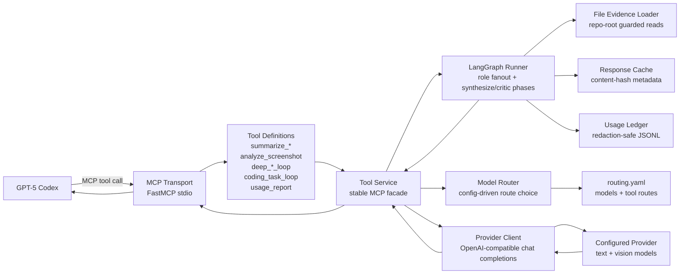

# Codex Deep Loop MCP Architecture

## Goal

Allow Codex to offload high-volume, low-value analysis to configured
OpenAI-compatible worker models while keeping code edits, shell commands,
architectural decisions, and final reasoning in Codex.

## High-Level Architecture



Codex sees only MCP tool names, descriptions, schemas, and results. It does not
choose provider models or see routing rules. The server instructions tell Codex
to use the server only for preprocessing and to keep decisions and code edits in
Codex.

## Recommended Project Structure

```text
codex-deep-loop-mcp/
  pyproject.toml
  README.md
  config/
    routing.yaml
    routing.example.yaml
  docs/
    architecture.md
    tool-schemas.json
  examples/
    codex.config.toml
  src/codex_rwth_mcp/
    __init__.py
    __main__.py
    config.py
    prompts.py
    router.py
    rwth_client.py
    server.py
    tools.py
    deep_loop.py
    deep_loop_graph.py
    usage.py
  tests/
    test_config.py
    test_router.py
    test_rwth_client.py
    test_tools.py
```

Responsibilities:

- `server.py`: MCP transport and tool registration.
- `tools.py`: tool service API and result shape.
- `router.py`: deterministic model routing.
- `rwth_client.py`: OpenAI-compatible chat-completions wrapper. The filename is retained for compatibility with the initial RWTH/KI:connect implementation.
- `prompts.py`: prompt templates.
- `config.py`: YAML parsing and validation.
- `deep_loop.py`: stable deep-loop service facade, guarded file evidence loading, response caching, usage accounting, and result parsing.
- `deep_loop_graph.py`: LangGraph orchestration for bounded role fanout, synthesizer/critic phases, and supervised patch drafts.
- `usage.py`: redaction-safe provider usage event ledger and report aggregation.

## Detailed Implementation Plan

1. Define MCP-facing tool contracts for logs, repo excerpts, screenshots, and diffs.
2. Create a YAML config schema for provider endpoint, model catalog, and per-tool route rules.
3. Implement config loading with validation for unknown models and invalid vision routes.
4. Implement deterministic routing by tool, payload size, vision requirement, priority, and cost weight.
5. Implement a provider client around the OpenAI-compatible chat-completions API.
6. Implement prompt builders that force compact, actionable handoff summaries.
7. Register tools through FastMCP and keep routing hidden behind the service layer.
8. Add Codex config examples for stdio MCP setup.
9. Add unit tests with fake clients so CI never calls live providers.
10. Add future hardening around truncation, PII redaction, observability, and retries.

## Model-Routing Strategy

Routing is configuration-driven and deterministic:

1. Select the tool route list by MCP tool name.
2. Filter routes by required capability, currently `requires_vision`.
3. Filter by `min_input_chars` and `max_input_chars`.
4. Sort remaining routes by `priority`, then `cost_weight`, then effective context limit.
5. Use the first matching route.
6. Return a machine-readable error if no route can handle the payload.

This gives a conservative cost policy: cheaper/smaller models handle normal
payloads, while larger context models are used only when needed. Adding a future
model is a config change unless it introduces a new capability dimension.

## Configuration Examples

Use `config/routing.example.yaml` for the full routing example. Key fields:

```yaml
rwth:
  base_url: https://llm.hpc.itc.rwth-aachen.de
  api_key_env: RWTH_OPENAI_API_KEY

models:
  cheap_text:
    id: mistralai/Mixtral-8x22B-Instruct-v0.1
    supports_vision: false
    max_input_chars: 64000
    cost_weight: 1.0

tools:
  summarize_logs:
    max_output_tokens: 900
    temperature: 0.1
    routes:
      - model: cheap_text
        max_input_chars: 60000
        priority: 10
```

## MCP Tool Schemas

The explicit schemas are in `docs/tool-schemas.json`. FastMCP also derives
schemas from the annotated Python function signatures in `server.py`.

## Codex Configuration Examples

Codex can run this as a stdio MCP server. Use the example in
`examples/codex.config.toml` or the CLI:

```bash
codex mcp add codex_deep_loop \
  --env CODEX_DEEP_LOOP_MCP_CONFIG=/absolute/path/to/config/routing.yaml \
  --env RWTH_OPENAI_API_KEY="$RWTH_OPENAI_API_KEY" \
  -- python -m codex_rwth_mcp
```

Codex's current MCP configuration supports stdio servers, environment
variables, tool allow lists, startup timeout, tool timeout, and per-tool
approval settings. The implementation uses stdio because it is the smallest
local deployment surface for Codex.

## Security Considerations

- Keep provider API keys in the environment or a secret manager, not in git.
- Treat logs, diffs, repo excerpts, and screenshots as potentially sensitive.
- Add a redaction middleware before production use for secrets, tokens, emails,
  private URLs, student IDs, and customer data.
- Keep Codex as the only layer that edits files or makes final decisions.
- Deep-loop file reads are constrained to explicitly supplied repo-relative paths,
  current or configured repo-root confinement, secret/binary exclusions, and
  per-file size caps.
- LangGraph nodes coordinate only analysis phases and do not edit files, run shell
  commands, or interrupt Codex mid-call.
- `coding_task_loop` can propose unified diffs, but Codex must apply or rewrite
  patches and run tests in the active checkout.
- Deep-loop `analysis_depth` controls bounded worker-model breadth:
  `fast` is mapper-only, `standard` adds risk finding, `deep` and `exhaustive`
  use mapper, risk finder, test strategist, and architecture critic roles.
  `coding_task_loop` is the only tool with a patch drafter role.
- Usage logging stores metadata only: tool, model, phase, cache status, token
  usage when available, role, analysis depth, and character estimates. It does
  not store prompts, evidence, API keys, or raw outputs.
- Set conservative `tool_timeout_sec` values in Codex config.
- Log metadata, route names, and durations, but avoid logging raw prompts by default.
- Pin dependencies in production and run the server in a dedicated virtualenv.
- Prefer user-level Codex MCP config for secrets; project config is fine for
  non-secret paths in trusted repos.
- KI:connect usage is governed by the KI:connect terms of use and institutional
  authorization. Configure another compliant OpenAI-compatible provider for
  private, commercial, or otherwise non-covered use cases.

## Step-by-Step Build Order

1. Create `pyproject.toml` and test skeleton.
2. Write tests for config validation.
3. Implement `config.py`.
4. Write tests for route selection and no-route errors.
5. Implement `router.py`.
6. Write fake-client tests for OpenAI-compatible payloads.
7. Implement `rwth_client.py`.
8. Write tool-service tests for result shape and hidden routing.
9. Implement `prompts.py` and `tools.py`.
10. Register FastMCP tools in `server.py`.
11. Add `config/routing.example.yaml`.
12. Add Codex config examples.
13. Run unit tests.
14. Install dependencies in a virtualenv and smoke test MCP startup.

## MVP Implementation Scope

Included:

- Python package with stdio MCP entrypoint.
- Four requested MCP tools.
- Config-driven model catalog and routing.
- Hidden model-selection logic.
- OpenAI-compatible chat-completions client.
- Vision payload support for screenshots.
- Unit tests for config, routing, client payloads, and tool service behavior.
- Documentation and configuration examples.

Not included in MVP:

- Live provider integration test, because it requires real credentials and endpoint details.
- Token-aware chunking; routing currently uses character counts as a stable proxy.
- Automatic redaction.
- Retries/backoff and circuit breaking.
- OpenTelemetry/exported metrics.
- Streamable HTTP deployment.

## Future Enhancements

- Tokenizer-based payload sizing per model/provider.
- Additional specialized LangGraph nodes for repo maps, debugging, and diff review.
- More structured JSON parsing for judged role outputs.
- Tokenizer-based chunking for very large logs and repositories.
- Secret/PII redaction pipeline with allow-list overrides.
- Retry, timeout, and fallback policy per model route.
- Structured JSON result schemas per tool.
- Route telemetry and cost accounting.
- Streamable HTTP transport for shared team deployment.
- Per-repo routing overrides and policy profiles.
- Optional local caching keyed by content hash.
- LangGraph checkpointing or resumable workflows if Codex gains a reliable
  interrupt/resume integration contract.
- Evaluation fixtures for summarization quality and regression testing.

## Source Notes

- Codex MCP config and supported transports were checked against the current
  Codex manual section for Model Context Protocol.
- FastMCP usage follows the official `modelcontextprotocol/python-sdk` package
  examples for `mcp.server.fastmcp.FastMCP`, tool decorators, and stdio
  transport.
